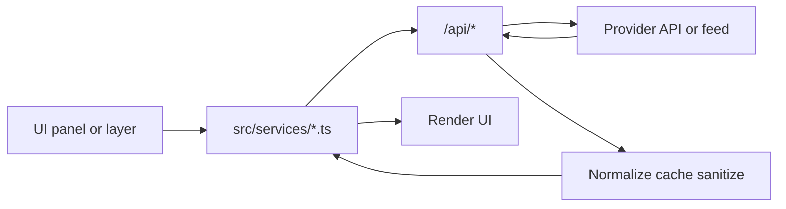

# World Monitor (Fork)

This repository is a real-time monitoring dashboard.
It combines news, geopolitical signals, infrastructure events,
and market data.

This README explains one thing:
how data is fetched, processed, and shown.

## Runtime Modes

1. Web production
Frontend runs in browser (`src/*`).
API runs as edge/serverless handlers (`api/*.js`).

2. Desktop (Tauri)
Frontend runs inside Tauri.
`/api/*` is routed to a local sidecar first
(`127.0.0.1:46123`), then to cloud fallback if needed.

3. Local dev
Frontend runs on Vite.
API calls are handled by Vite proxy routes and selected local handlers.

Core runtime switching is in `src/services/runtime.ts`.
The fetch patch is installed in `src/main.ts`.

## Data Pipeline



In desktop mode, step `C` is local sidecar first.

## Core Design Rule

Client code usually does not call third-party APIs directly.
It calls `/api/*` routes.

Why:

- Secrets stay server-side (`process.env.*`)
- CORS and domain filtering are centralized
- Rate limits and timeouts are centralized
- Cache and fallback behavior is consistent

## End-to-End Examples

### News (RSS)

1. `src/services/rss.ts` reads feed URLs from `src/config/feeds.ts`.
2. Each URL is sent to `/api/rss-proxy?url=...`.
3. `api/rss-proxy.js` checks domain allowlist,
   applies timeout, and follows safe redirects.
4. Client parses XML, classifies threat level,
   and updates keyword trends.
5. Circuit breaker and persistent cache reduce failure impact.

### Protests (ACLED + GDELT)

1. `src/services/protests.ts` fetches `/api/acled` and
   `/api/gdelt-geo` in parallel.
2. `api/acled.js` uses `ACLED_ACCESS_TOKEN`,
   with rate limit and cache.
3. Service validates coordinates and maps severity.
4. Events are deduplicated by coarse location and date.
5. Result is grouped by country for map and risk panels.

### Military Flights

1. `src/services/military-flights.ts` queries hotspot boxes.
2. Base endpoint is relay when configured,
   otherwise `/api/opensky`.
3. Requests are batched to reduce throttling.
4. Wingbits enrichment is applied when key exists.
5. Cached fallback is returned when live fetch fails.

### AIS Vessel Snapshot

1. `src/services/ais.ts` polls `/api/ais-snapshot`.
2. `api/ais-snapshot.js` fetches relay snapshot,
   validates payload, and caches short-lived responses.
3. Service exposes disruptions and density
   to map layers and callbacks.

## Reliability Model

The app is designed to degrade gracefully.

Main pieces:

- Client circuit breakers: `src/utils/circuit-breaker.ts`
- Exponential retry: `src/utils/retry.ts`
- Freshness tracking: `src/services/data-freshness.ts`
- Shared cache helper: `api/_upstash-cache.js`
- Shared CORS policy: `api/_cors.js`
- Per-IP limiter: `api/_ip-rate-limit.js`

Typical failure flow:

1. Try live provider
2. On error, return cached data if available
3. If no cache, return empty or baseline payload
4. UI keeps running with partial data

## Caching Layers

1. Browser/service cache
Example: RSS service memory cache + persistent cache.

2. API shared cache
`api/_upstash-cache.js` uses Upstash Redis in cloud.
In desktop sidecar mode, it uses memory plus persisted JSON.

3. HTTP cache headers
Many API handlers return `Cache-Control` with
`stale-while-revalidate`.

## Refresh Strategy

Scheduling is in `src/App.ts`:
`setupRefreshIntervals()` and `scheduleRefresh()`.

Default refresh intervals:

- News: 5 minutes
- Markets: 2 minutes
- Predictions: 5 minutes
- Intelligence bundle (full variant): 5 minutes
- Weather, flights, cyber: 10 minutes
- FRED and oil: 30 minutes
- Spending: 60 minutes

Scheduler behavior:

- Hidden tab multiplies interval by 4
- Random jitter (plus/minus 10 percent)
- Disabled layer or panel skips fetch
- In-flight task defers next run

## Key Routes and Secrets

- RSS: `src/services/rss.ts` -> `/api/rss-proxy` (no key)
- ACLED protests: `src/services/protests.ts` -> `/api/acled`
  (`ACLED_ACCESS_TOKEN`)
- ACLED conflicts: `src/services/conflicts.ts` -> `/api/acled-conflict`
  (`ACLED_ACCESS_TOKEN`)
- Outages: `src/services/outages.ts` -> `/api/cloudflare-outages`
  (`CLOUDFLARE_API_TOKEN`)
- AIS: `src/services/ais.ts` -> `/api/ais-snapshot`
  (relay config via `WS_RELAY_URL`)
- Markets: `src/services/markets.ts` -> `/api/finnhub`,
  `/api/yahoo-finance`, `/api/coingecko`
  (`FINNHUB_API_KEY` optional)
- Summarization: `src/services/summarization.ts` ->
  `/api/groq-summarize`, `/api/openrouter-summarize`
  (`GROQ_API_KEY`, `OPENROUTER_API_KEY`)
- FRED: `src/services/fred.ts` -> `/api/fred-data` (`FRED_API_KEY`)
- EIA: `src/services/oil-analytics.ts` -> `/api/eia/*` (`EIA_API_KEY`)
- FIRMS: `src/services/firms-satellite.ts` -> `/api/firms-fires`
  (`NASA_FIRMS_API_KEY` optional)

All available keys are listed in `.env.example`.

## Desktop Flow

Desktop mode (`npm run desktop:dev`) uses:

1. Fetch interception in `src/services/runtime.ts`
2. Local sidecar router in `src-tauri/sidecar/local-api-server.mjs`
3. Optional cloud fallback when local handler fails
4. Local token auth between UI and sidecar

## Local Setup

```bash
npm install
cp .env.example .env.local
npm run dev
```

Useful commands:

```bash
npm run typecheck
npm run test:sidecar
npm run test:e2e:runtime
npm run desktop:dev
```

## Adding a New Data Source

1. Add handler in `api/`
2. Keep secrets in server env (`process.env.*`)
3. Add validation, timeout, and fallback response
4. Add cache if source is expensive
5. Add client service in `src/services/`
6. Wire refresh in `src/App.ts`
7. Update freshness tracking if needed

## Files To Read First

- Runtime switching: `src/services/runtime.ts`
- Main scheduler: `src/App.ts`
- Feed catalog: `src/config/feeds.ts`
- Sidecar server: `src-tauri/sidecar/local-api-server.mjs`
- API handlers: `api/*.js`
- Desktop parity notes: `docs/local-backend-audit.md`
